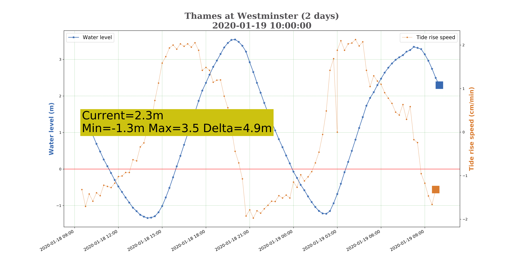
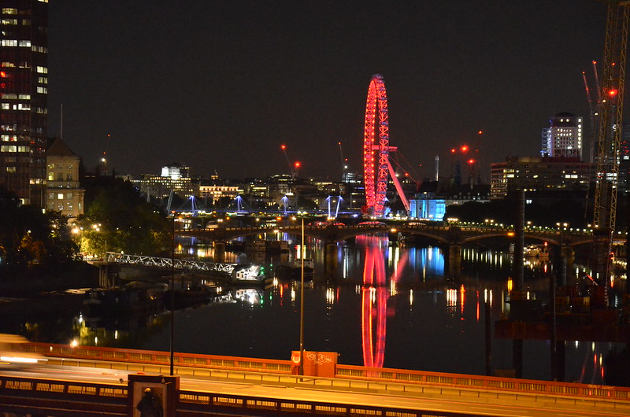

# Tides

Started getting interested in Thames flow when in search for the rather rare moment when the river is at slack water.
To get reflections on the surface of the water not only Thames should be between tides but there should be no winds and no boats.
In a blue moon it happens, as below.

Data is scrapped from the .gov site and enriched with the tide rise speed graph and max and min levels.

